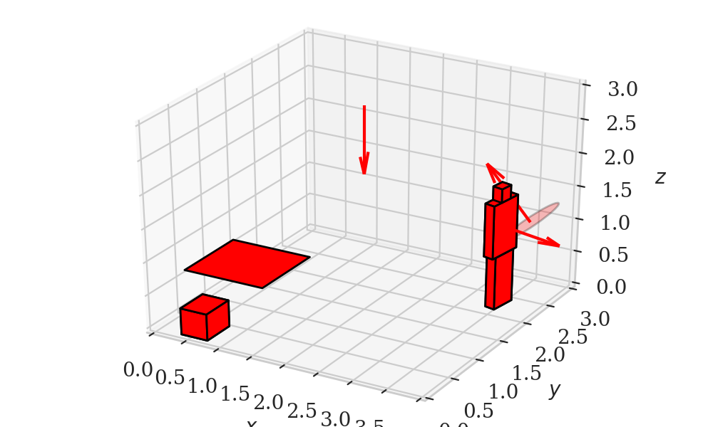
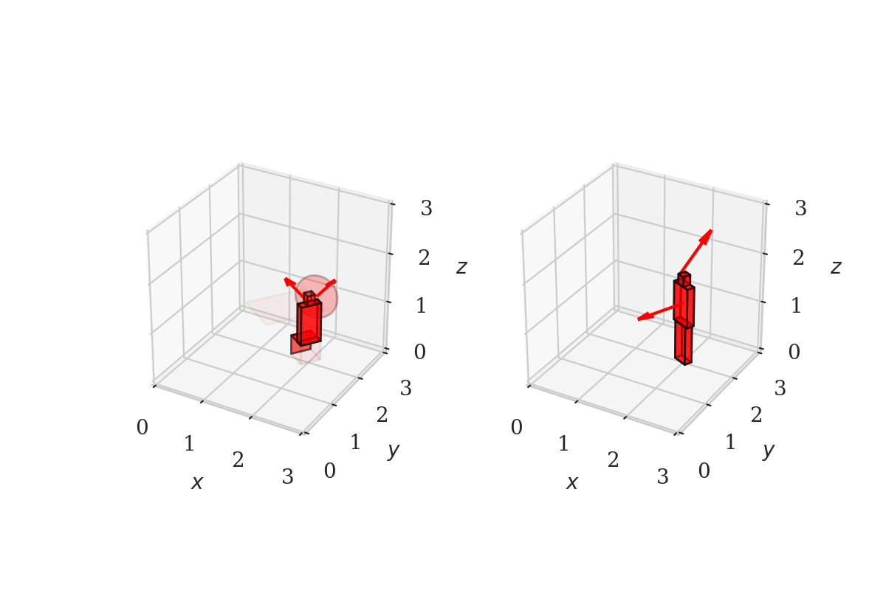
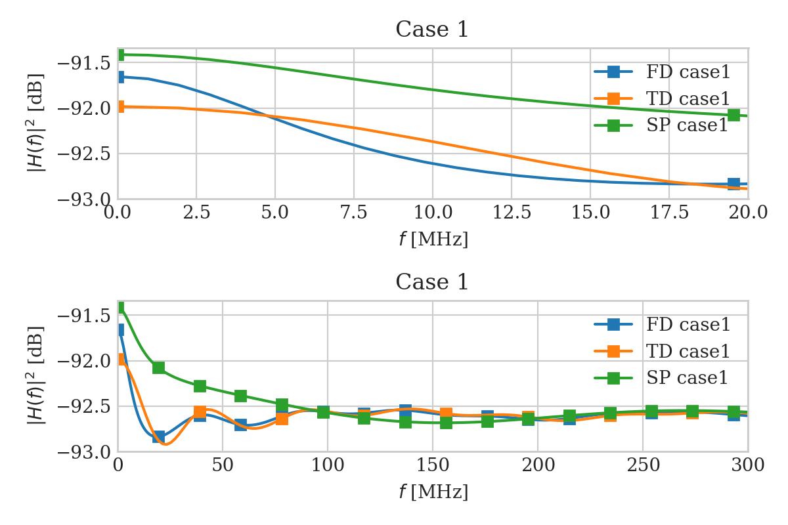
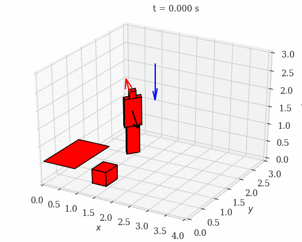

OWCsim-Py
=========

Summary
-------

OWCsim-Py is a Python simulator for optical wireless communications (OWC). 

This package is still in its very early version and only contains channel impulse response (CIR) generator.

The CIR generator contains two main modules, i.e., geometry modules and signal processing modules. The geometry modules are written by using Python for readability. The signal processing modules are written in C for fast computation. The documentation is available under the 'doc' folder.

Features
--------

1. Geometry

Currently, OWCsim-Py supports modules to generate a basic geometric object. What I have in mind now is to have a codebase that can generate Minecraft-like objects. In addition, basic primitives such as blocking detection and partitioning an object are also supported.

Figures below show a few objects that can be generated, e.g., a human model, point source models, or simple furniture.

2. Use case

Freq. and time domain CIR calculations by Schulze and Carruthers (modified version of Kahn and Barry's), respectively. Both of them have been C-optimized and multi-thread-enabled. I also add a quick implementation of a sphere model by Jungnickel.

Figures below show frequency responses of the frequency domain approach ('FD'), the time domain approach ('TD'), and the sphere model ('SP').

3 Animation

Some models of random mobility and orientation are also included. 

Installation
------------

.. note::

    I haven't spent enough time to optimize this installation process. I have tried this installation process in MacOS, Linux (university's machine and Ubuntu) and Ubuntu shell in Windows 10. 

Following is my dependencies list. You don't need to necessarily have the same version as mine. 

.. code::

    python=3.7.3
    gcc=4.8.5
    openmp=8.0.0
    numpy=1.16.3
    scipy=1.2.1
    matplotlib=3.0.3
    cython=0.29.7
    jupyter=1.0.0
    sphinx=2.0.1
    numpydoc=0.9.1
    nbsphinx=0.4.2
    sphinx_rtd_theme=0.4.3

Here is my go-to steps in installing this package in a new machine.

1. Install `miniconda3 <https://docs.conda.io/en/latest/miniconda.html>`_

2. Create a virtual env using conda and install the necessary packages
    
    .. code ::

        conda create --name owcsimpy-build
        conda activate owcsimpy-build
        bash ./installpackageconda.sh

3. Run setup.py

    .. code ::

        python3 setup.py --cython install --record installation.txt >&1 | tee record.txt

    .. note::

        If you have Intel processors, I recommend you to use MKL and compilers from Intel. 

4. Verify

    .. code ::

        cd notebooks
        python -c "import owcsimpy" 

    This should return nothing, otherwise it returns an error message.

    Then, you can play around with the tutorials.

    .. code ::

        jupyter-notebook

Tutorial
--------

Please checkout brief snippets of what this package can currently do.

* `CIR <./notebooks/UseCase_1_CIR.ipynb>`_

* `Basic Geometry_bases <./notebooks/Basic_1_Geometry-Bases.ipynb>`_

* `Basic Geometry_model <./notebooks/Basic_2_Geometry-Models.ipynb>`_

* `Simple Office Environment <./notebooks/UseCase_2_SimpleOfficeEnv.ipynb>`_

 